# Project UI Showcase

A comprehensive visual documentation of the application's user interface.

## 📱 Screenshots

### Onboarding / Initial Screens

**First Page**  
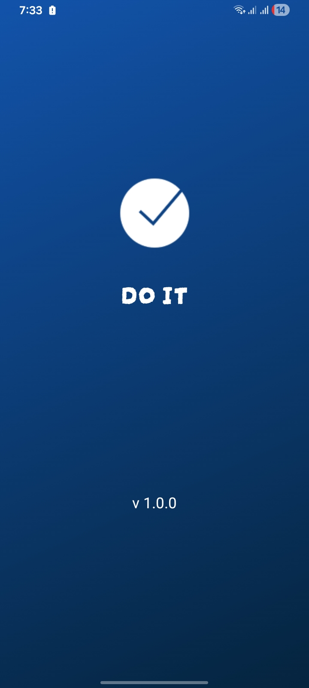

**Second Page**  
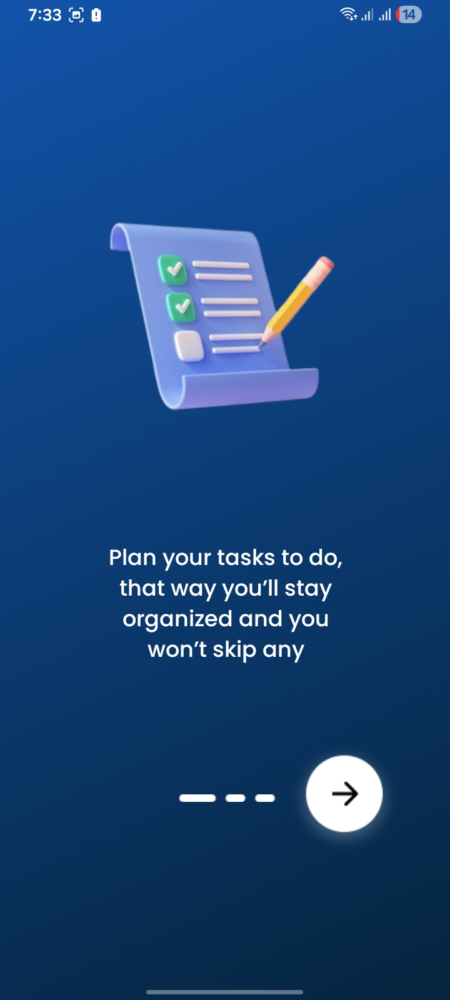

**Third Page**  

**Fourth Page**  
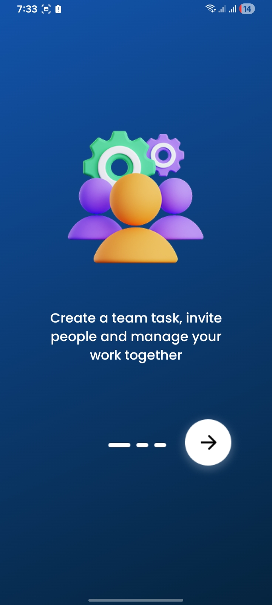

**Fifth Page**  
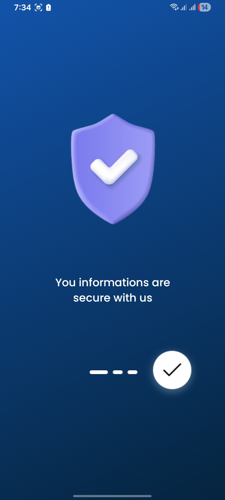

**Sixth Page**  

**Seventh Page**  
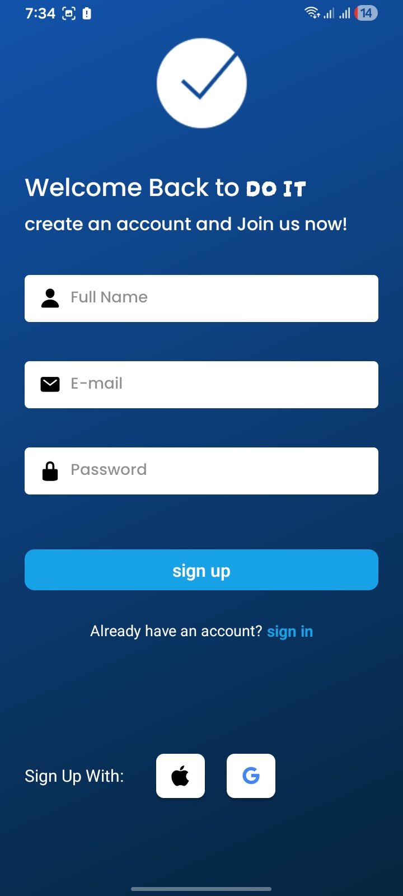

**Eighth Page**  
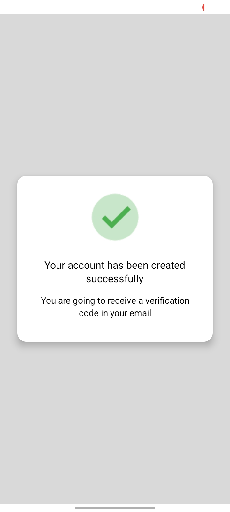

**Ninth Page**  
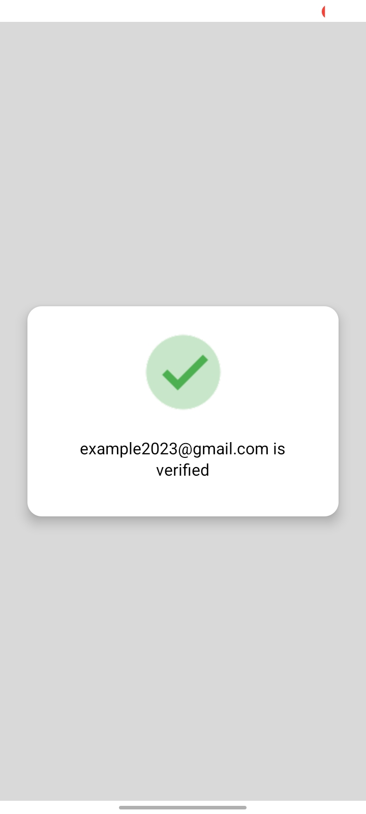

**Tenth Page**  

---

### Main App with Bottom Tab Navigation

**🏠 Homepage**  
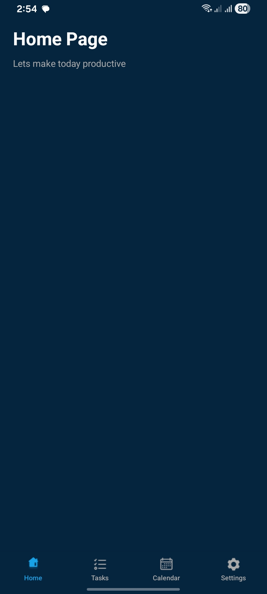

**✅ Tasks**  
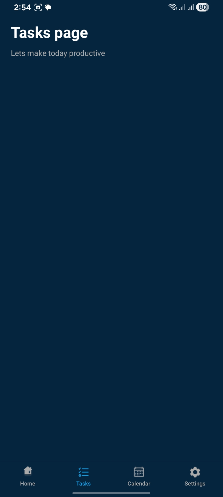

**📅 Calendar**  
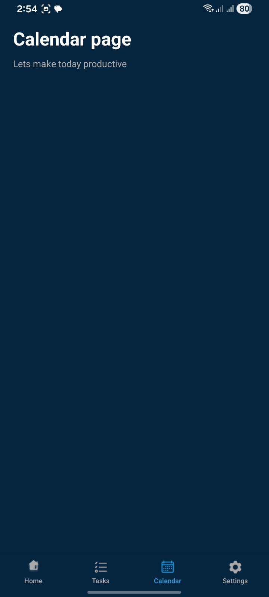

**⚙️ Settings**  
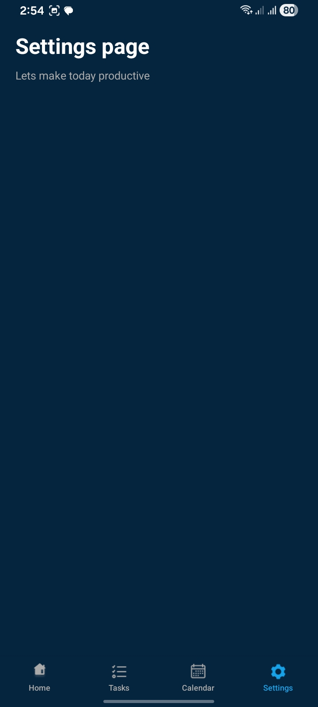

---

## ✨ Features Highlighted

- Clean and modern UI design
- Smooth onboarding flow (10 screens)
- Bottom tab bar navigation
- Responsive layout across different sections

---

## 📁 Image Structure

All screenshots are stored in the `readmeImages/` directory:

- `image-1.png` to `image-10.png` → Onboarding screens
- `homepage.jpeg`, `taskspage.jpeg`, `calendar.jpeg`, `settings.jpeg` → Main app screens
